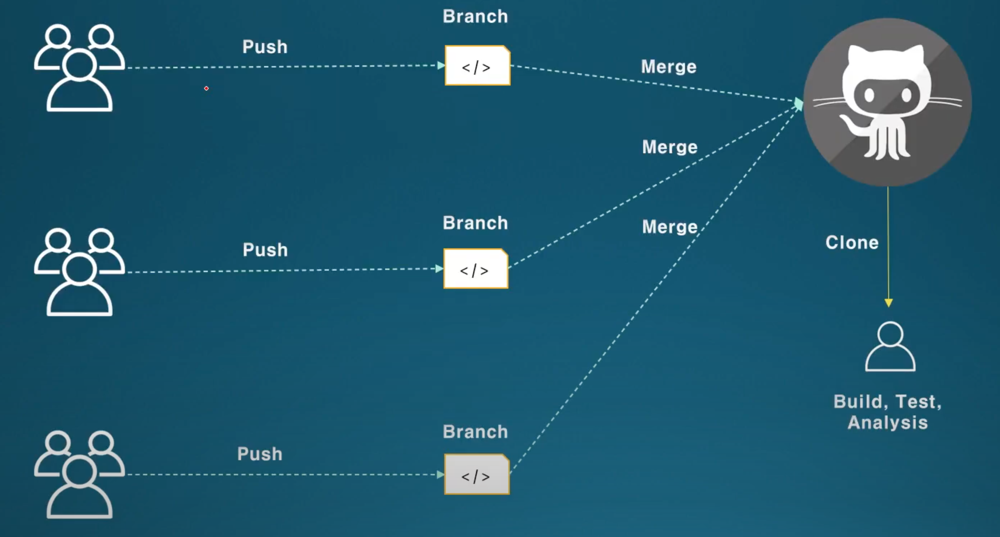
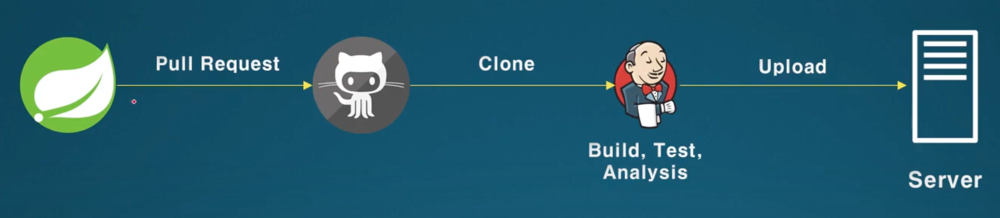

## **배포**

- 최종 사용자에게 소프트웨어를 전달하는 과정
  - 인터넷을 통한 소프트웨어 배포
- 시스템에 새로운 소프트웨어를 설치하는 과정
  - 새로운 소프트웨어를 시스템에 적용

## **빌드**

- 소스 코드를 실행 가능한 독립 가능한 소프트웨어로 변환하는 과정 (컴파일)

## **테스트**

- 소스 코드 단위에 기능적 테스트
- 독립된 소프트웨어의 기능적 테스트

## **Jenkins**

- CI Tools (Continuous Integration Tools)

  - 다음을 자동으로 해준다
    - 빌드
    - 테스트
    - 정적 분석

- Before Jenkins

  

- After Jenkins

  

- Architecture

  

- Jenkins 자동화

  - `Pull Request`, `Merge Request` 같은 action이 trigger가 되어서 Jenkins를 호출